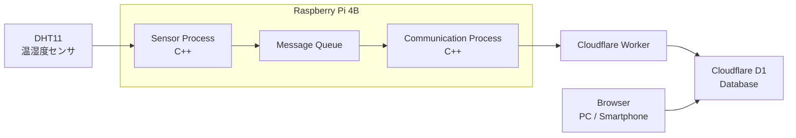
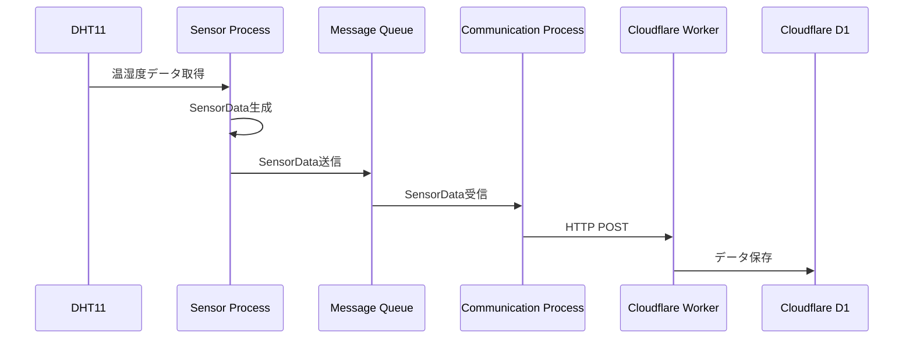
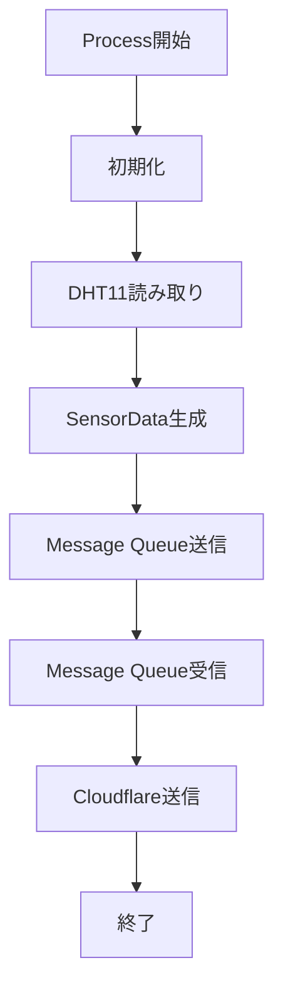

# Raspberry Pi 4B Edge IoT System
# 01_system_overview.md

## 1. システム目的

本システムは、Raspberry Pi 4Bを利用したIoTシステム開発を通して、

- Linux上でProcessを動作させる方法
- C++によるクラス分割
- Process間通信
- センサデータがクラウドへ送信される流れ

を理解することを目的とする。

本システムでは、温湿度センサ（DHT11）から取得したデータをRaspberry Pi上で処理し、Cloudflare Workerを経由してCloudflare D1へ保存する。

保存されたデータはブラウザから確認する。

本開発では、実際に動作するIoTシステムを完成させることを優先し、製品レベルの高度な設計は対象外とする。

---

# 2. システム概要

## 2.1 システム名称

Raspberry Pi 4B Edge IoT System

## 2.2 システム概要

本システムは以下の流れで動作する。

1. DHT11から温湿度データを取得する

2. Sensor Processが取得データをSensorDataへ変換する

3. Message Queueを使用してProcess間でデータを渡す

4. Communication Processがデータを受信する

5. Cloudflare WorkerへHTTP通信でデータを送信する

6. Cloudflare D1へデータを保存する

7. ブラウザから保存データを表示する

---

# 3. システム全体構成

---

# 4. ハードウェア構成

## 4.1 Raspberry Pi

|項目|内容|
|-|-|
|ボード|Raspberry Pi 4B|
|OS|Linux|
|開発言語|C++|
|通信|Wi-Fi|
|役割|IoT Edge Device|

Raspberry Piはセンサデータ取得とクラウド通信を担当する。

---

## 4.2 温湿度センサ

|項目|内容|
|-|-|
|センサ|DHT11|
|取得データ|温度、湿度|
|接続方式|GPIO|
|役割|環境データ取得|

DHT11から取得した値をSensor Processが読み取る。

---

# 5. ソフトウェア構成

## 5.1 Raspberry Pi側ソフトウェア

### Sensor Process

役割:

- DHT11から温湿度データ取得
- SensorData生成
- Message Queueへ送信

### Communication Process

役割:

- Message QueueからSensorData取得
- Cloudflare WorkerへHTTP送信

---

## 5.2 使用する主要クラス

### Dht11Sensor

役割:

DHT11センサを制御し、温湿度データを取得する。

主な処理:

- GPIO制御
- センサ値取得

---

### SensorDataMessageQueue

役割:

Sensor ProcessとCommunication Process間でデータを受け渡す。

主な処理:

- データ送信
- データ受信

---

### CloudflareClient

役割:

Cloudflare WorkerへHTTP通信を行う。

主な処理:

- JSONデータ生成
- HTTP POST送信

---

# 6. データフロー

## 6.1 データ取得から保存まで

---

# 7. ソフトウェア処理イメージ

---

# 8. 開発範囲

## 実装対象

以下を実装する。

- DHT11データ取得
- Sensor Process
- Message Queue通信
- Communication Process
- Cloudflare Worker通信
- Cloudflare D1保存
- ブラウザ表示

---

## 今回対象外とする機能

以下は実装しない。

- 通信リトライ
- 複雑なエラー処理
- セキュリティ対策
- 認証処理
- 暗号鍵管理
- 冗長化
- データ保証
- 高度なログ管理
- 障害復旧処理
- 詳細なsystemd設計

---

# 9. 設計方針まとめ

本システムでは、

「センサデータがLinux上のProcessを経由してクラウドへ届く流れ」

を理解することを最優先とする。

そのため、

- シンプルなProcess構成
- 明確な責務分割
- 少ないクラス数
- 動作確認しやすい構成

を採用する。

完成後には、

DHT11
↓
Raspberry Pi Linux Process
↓
Message Queue
↓
Cloudflare
↓
Database
↓
Browser

というIoTシステム全体の流れを理解できる状態を目標とする。