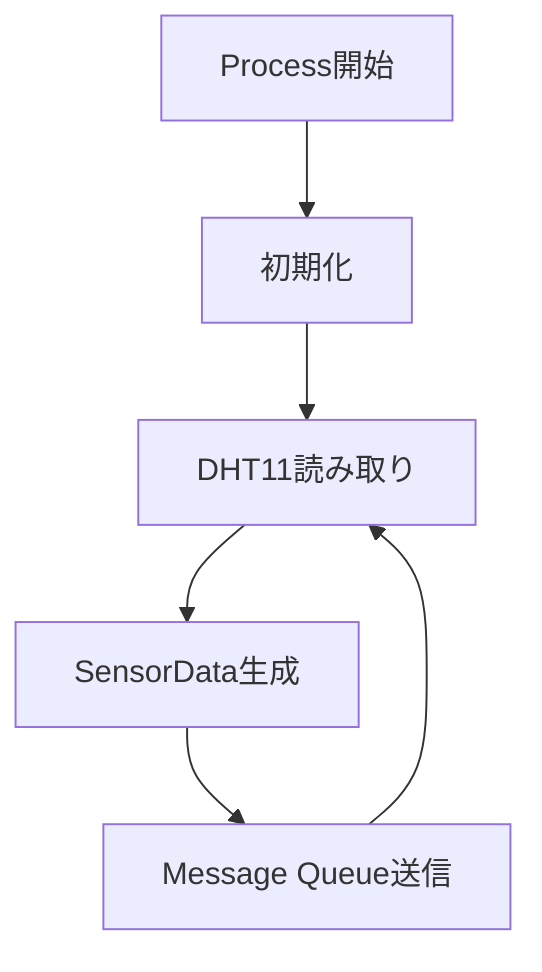
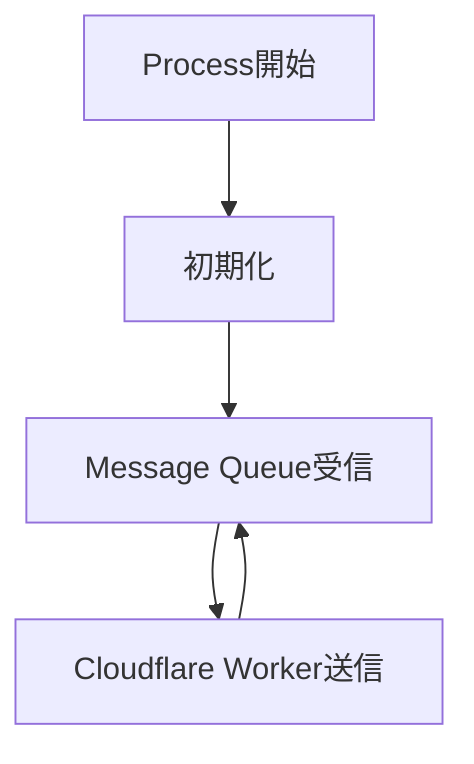
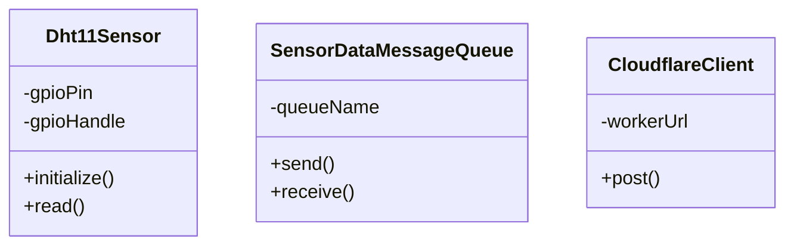
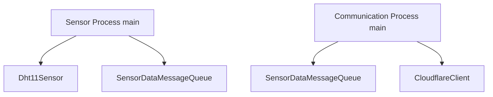

# Raspberry Pi 4B Edge IoT System
# 02_program_design.md


# 1. プログラム設計概要


本システムは、以下の2つのProcessで構成する。


Processを分離することで、

- センサ取得処理
- 通信処理

を独立したプログラムとして管理する。


Sensor Processはセンサデータ取得を担当し、
Communication Processはクラウド通信を担当する。


---

# 2. Process構成


# 2.1 Sensor Process


## 役割


Sensor Processは、DHT11から温湿度データを取得し、
SensorDataを生成してMessage Queueへ送信する。


## 処理フロー





## 主な処理


- DHT11初期化
- 温度取得
- 湿度取得
- SensorData生成
- Message Queue送信


---

# 2.2 Communication Process


## 役割


Communication Processは、
Message QueueからSensorDataを受信し、
Cloudflare Workerへ送信する。


## 処理フロー





## 主な処理


- Message Queue受信
- SensorData取得
- JSONデータ生成
- HTTP POST送信


---

# 3. クラス構成


本システムでは、以下の3クラスを使用する。





---

# 4. Dht11Sensorクラス


## 4.1 役割


DHT11センサから温度・湿度データを取得するクラス。


Sensor Processから利用する。


## 4.2 メンバ変数


|変数|説明|
|-|-|
|gpioPin|DHT11接続GPIO番号|
|gpioHandle|GPIO制御用情報|


## 4.3 公開関数


|関数|説明|
|-|-|
|initialize()|GPIOなどの初期化を行う|
|read()|DHT11から温湿度データを取得する|


---

# 5. SensorDataMessageQueueクラス


## 5.1 役割


Sensor ProcessとCommunication Process間で
SensorDataを受け渡すためのクラス。


Linux Message Queueを利用する。


## 5.2 メンバ変数


|変数|説明|
|-|-|
|queueName|Message Queue名|


## 5.3 公開関数


|関数|説明|
|-|-|
|send()|SensorDataをQueueへ送信する|
|receive()|QueueからSensorDataを取得する|


---

# 6. CloudflareClientクラス


## 6.1 役割


Cloudflare WorkerへSensorDataを送信するクラス。


Communication Processから利用する。


## 6.2 メンバ変数


|変数|説明|
|-|-|
|workerUrl|Cloudflare Worker URL|


## 6.3 公開関数


|関数|説明|
|-|-|
|post()|SensorDataをHTTP送信する|


---

# 7. プログラム構成イメージ





---

# 8. ファイル構成


```text
Raspberry_Pi_4B_Edge_IoT_System

├── src
│
│   ├── sensor
│   │   ├── main.cpp
│   │   └── Dht11Sensor.cpp
│   │
│   ├── communication
│   │   ├── main.cpp
│   │   └── CloudflareClient.cpp
│   │
│   └── ipc
│       └── SensorDataMessageQueue.cpp
│
├── include
│
│   ├── sensor
│   │   └── Dht11Sensor.h
│   │
│   ├── communication
│   │   └── CloudflareClient.h
│   │
│   └── ipc
│       └── SensorDataMessageQueue.h
│
└── docs

```


---

# 9. 設計方針まとめ


本システムでは、以下の責務分離を行う。


|項目|担当|
|-|-|
|センサ取得|Dht11Sensor|
|Process間通信|SensorDataMessageQueue|
|クラウド通信|CloudflareClient|


また、Processについても、


|Process|担当|
|-|-|
|Sensor Process|データ取得|
|Communication Process|クラウド送信|


として役割を明確化する。


この構成により、

「取得」
↓
「データ受け渡し」
↓
「クラウド送信」

というIoTシステムの基本構造を理解できる。