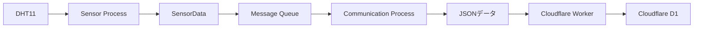
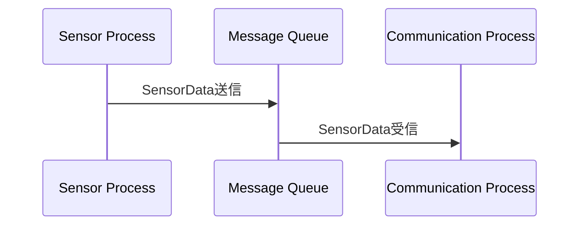
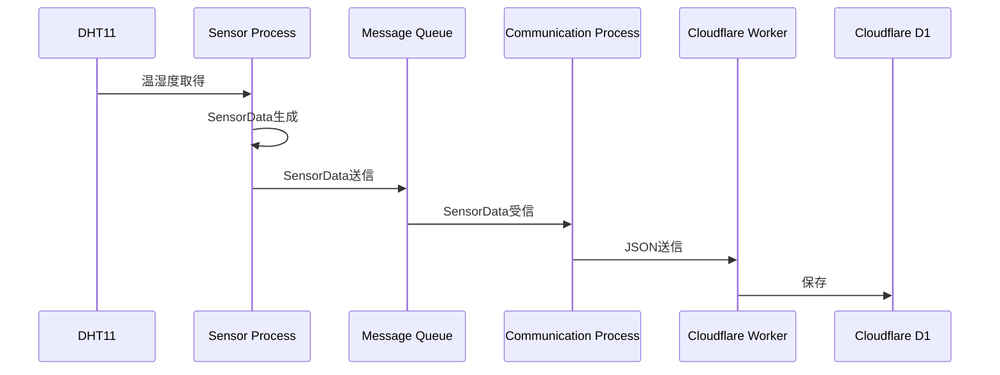

# Raspberry Pi 4B Edge IoT System
# 03_data_design.md


# 1. データ設計概要


本システムでは、温湿度データを `SensorData` 構造体として管理する。


Sensor Processで取得したセンサ情報をSensorDataへ格納し、
Message Queueを利用してCommunication Processへ渡す。


Communication ProcessではSensorDataをJSON形式へ変換し、
Cloudflare Workerへ送信する。


---

# 2. SensorData構造体


## 2.1 役割


SensorDataは、本システム内で温湿度データを扱うための共通データ形式である。


以下の処理で利用する。


- DHT11取得結果の保持
- Message Queue送信用データ
- Cloudflare送信用データ


---

# 2.2 データ定義


|項目|型|説明|
|-|-|-|
|data_id|int|データ識別番号|
|temperature|double|温度|
|humidity|double|湿度|
|timestamp|long|取得時刻|


---

# 2.3 SensorDataイメージ


```cpp
struct SensorData
{
    int data_id;

    double temperature;

    double humidity;

    long timestamp;
};
```


---

# 3. データ生成フロー


## 3.1 全体フロー





---

# 4. DHT11取得データ


## 入力データ


DHT11から以下のデータを取得する。


|項目|説明|
|-|-|
|Temperature|温度|
|Humidity|湿度|


Sensor Processは取得した値をSensorDataへ格納する。


---

# 5. SensorData生成


Sensor Processでは、
DHT11取得結果からSensorDataを生成する。


例:


```text
DHT11取得

Temperature : 25.5

Humidity    : 60.0


↓


SensorData生成


data_id     : 1

temperature : 25.5

humidity    : 60.0

timestamp   : 1234567890

```


---

# 6. Message Queueデータ


## 6.1 役割


Message Queueは、
Sensor ProcessとCommunication Process間でSensorDataを受け渡す。





---

## 6.2 Queueで渡すデータ


Message QueueではSensorData構造体をそのまま送信する。


送信内容:


|項目|内容|
|-|-|
|data_id|データ番号|
|temperature|温度|
|humidity|湿度|
|timestamp|取得時刻|


---

# 7. Cloudflare送信データ


Communication Processでは、
SensorDataをJSON形式へ変換する。


## JSON例


```json
{
    "data_id":1,
    "temperature":25.5,
    "humidity":60.0,
    "timestamp":1234567890
}
```


---

# 8. Cloudflare D1保存データ


Cloudflare Workerは受信したJSONデータを
Cloudflare D1へ保存する。


## テーブルイメージ


|カラム|型|説明|
|-|-|-|
|id|INTEGER|データ識別ID|
|data_id|INTEGER|センサデータ番号|
|temperature|REAL|温度|
|humidity|REAL|湿度|
|timestamp|INTEGER|取得時刻|


---

# 9. データの流れまとめ





---

# 10. 設計方針まとめ


本システムでは、SensorDataを中心にデータを統一する。


データの流れ:


```
DHT11

↓

SensorData

↓

Message Queue

↓

JSON

↓

Cloudflare D1

```


SensorDataを共通形式として扱うことで、

- センサ取得処理
- Process間通信
- クラウド通信

を分離し、それぞれの役割を明確にする。