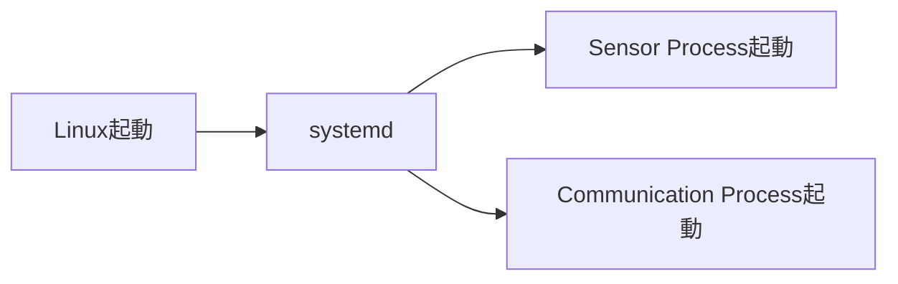
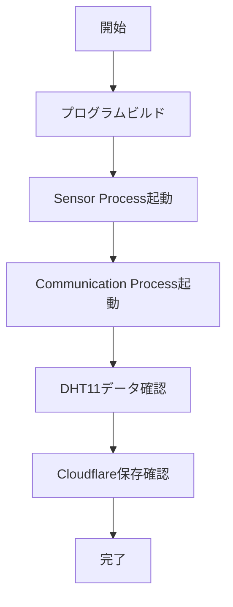

# Raspberry Pi 4B Edge IoT System
# 04_operation.md


# 1. 運用概要


本システムは、Raspberry Pi上で2つのProcessを動作させる。


構成:


```
Sensor Process

        ↓

Message Queue

        ↓

Communication Process

        ↓

Cloudflare Worker

        ↓

Cloudflare D1

```


Sensor ProcessとCommunication Processを起動することで、
センサデータ取得からクラウド保存までの動作を確認できる。


---

# 2. 開発環境


## 2.1 ハードウェア


|項目|内容|
|-|-|
|ボード|Raspberry Pi 4B|
|OS|Linux|
|通信|Wi-Fi|
|センサ|DHT11|


---

## 2.2 ソフトウェア


|項目|内容|
|-|-|
|開発言語|C++|
|ビルド方式|CMake|
|コンパイラ|g++|
|通信方式|HTTP|
|クラウド|Cloudflare Worker|
|データベース|Cloudflare D1|


---

# 3. ソースコードビルド方法


## 3.1 リポジトリ取得


```bash
git clone <repository-url>

cd Raspberry_Pi_4B_Edge_IoT_System
```


---

## 3.2 ビルドディレクトリ作成


```bash
mkdir build

cd build
```


---

## 3.3 CMake実行


```bash
cmake ..
```


---

## 3.4 ビルド


```bash
make
```


ビルド成功すると、
Sensor ProcessとCommunication Processの実行ファイルが生成される。


---

# 4. Process実行方法


## 4.1 Sensor Process起動


Sensor Processを起動する。


```bash
./sensor-process
```


起動後、以下の処理を実行する。


```
DHT11読み取り

↓

SensorData生成

↓

Message Queue送信

```


---

## 4.2 Communication Process起動


別ターミナルでCommunication Processを起動する。


```bash
./communication-process
```


起動後、以下の処理を実行する。


```
Message Queue受信

↓

JSON生成

↓

Cloudflare Worker送信

```


---

# 5. Process停止方法


Process停止は、
キーボード入力で終了する。


```text
Ctrl + C
```


Ctrl + Cを入力するとProcessを停止する。


---

# 6. 動作確認方法


## 6.1 Raspberry Pi側確認


Sensor Processのログを確認する。


確認内容:


- DHT11からデータ取得できているか
- SensorDataが生成されているか
- Message Queueへ送信されているか


例:


```
Temperature : 25.5

Humidity : 60.0

Data ID : 1

```


---

Communication Processのログを確認する。


確認内容:


- Message Queueから受信できているか
- Cloudflare Workerへ送信できているか


例:


```
Receive SensorData

Send Cloudflare Request

HTTP Status : 200

```


---

# 7. Cloudflare側確認


## 7.1 Worker確認


Communication Processから送信されたデータが、
Cloudflare Workerで受信されていることを確認する。


確認項目:


- HTTPリクエスト受信
- JSONデータ解析
- D1保存処理


---

## 7.2 D1確認


Cloudflare D1にデータが保存されていることを確認する。


確認項目:


|項目|確認内容|
|-|-|
|temperature|温度値|
|humidity|湿度値|
|timestamp|取得時刻|


---

# 8. systemdについて


## 8.1 systemdとは


systemdはLinuxで使用されるサービス管理機能である。


Processをサービスとして登録することで、
Linux起動時に自動的にProcessを開始できる。


---

## 8.2 本システムでの利用イメージ





---

## 8.3 systemd利用目的


本システムでは、

「Raspberry Pi起動時にIoT Processを自動起動する」

ために利用する。


詳細なサービス設計や障害復旧設計は対象外とする。


---

# 9. 動作確認フロー





---

# 10. 運用方針まとめ


本システムでは、

- Sensor Process
- Message Queue
- Communication Process
- Cloudflare Worker
- Cloudflare D1


というIoTシステムの基本構成を確認する。


運用では、

```
センサ取得

↓

Process間通信

↓

クラウド送信

↓

データ保存

```

の流れが正常に動作することを確認する。


本システムは、IoTシステム全体の構造理解を目的とし、
複雑な運用管理機能は実装対象外とする。