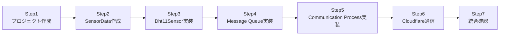
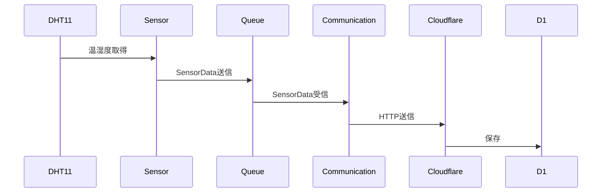

# Raspberry Pi 4B Edge IoT System
# 05_implementation_plan.md


# 1. 実装方針


本システムは、以下の順番で段階的に実装する。


基本方針:


- まず単体で動作確認する
- 次にProcess間通信を追加する
- 最後にクラウド通信を接続する


全体を一度に作成せず、
小さい機能単位で完成させる。


---

# 2. 実装ステップ概要





---

# 3. Step1 プロジェクト作成


## 目的


C++開発環境を準備する。


## 実装内容


- ディレクトリ作成
- CMake設定
- ビルド確認


## 作成対象


```text
src/

include/

build/

CMakeLists.txt

```


## 完成条件


以下が成功すること。


```bash
cmake ..

make

```


---

# 4. Step2 SensorData作成


## 目的


システム内で扱うデータ形式を決定する。


## 実装内容


SensorData構造体を作成する。


作成ファイル:


```text
include/common/SensorData.h

```


## データ項目


```text
data_id

temperature

humidity

timestamp

```


## 完成条件


SensorDataを生成できること。


---

# 5. Step3 Dht11Sensor実装


## 目的


DHT11から温湿度データを取得する。


## 実装内容


クラス:


```text
Dht11Sensor

```


作成ファイル:


```text
include/sensor/Dht11Sensor.h

src/sensor/Dht11Sensor.cpp

```


## 主な処理


- GPIO初期化
- DHT11読み取り
- 温湿度取得


## 完成条件


Sensor Process単体で、

```
Temperature

Humidity

```

が取得できること。


---

# 6. Step4 Message Queue実装


## 目的


Process間通信を実装する。


## 実装内容


クラス:


```text
SensorDataMessageQueue

```


作成ファイル:


```text
include/ipc/SensorDataMessageQueue.h

src/ipc/SensorDataMessageQueue.cpp

```


## 主な処理


- Queue作成
- データ送信
- データ受信


## 完成条件


2つのProcess間でSensorDataを渡せること。


---

# 7. Step5 Communication Process実装


## 目的


Message Queueからデータを受信するProcessを作成する。


## 実装内容


Process:


```text
communication-process

```


処理:


```
Message Queue受信

↓

SensorData取得

↓

送信データ生成

```


## 完成条件


Sensor Processから送信されたデータを受信できること。


---

# 8. Step6 Cloudflare通信実装


## 目的


取得したデータをクラウドへ送信する。


## 実装内容


クラス:


```text
CloudflareClient

```


作成ファイル:


```text
include/communication/CloudflareClient.h

src/communication/CloudflareClient.cpp

```


## 主な処理


- JSON生成
- HTTP POST送信


## 完成条件


Cloudflare Workerがデータを受信できること。


---

# 9. Step7 システム統合確認


## 目的


全体動作を確認する。


## 確認内容





## 完成条件


以下が確認できること。


- DHT11データ取得
- Message Queue通信
- Cloudflare送信
- D1保存
- ブラウザ表示


---

# 10. 実装順序の理由


本システムでは、以下の順序で実装する。


## データ定義

↓

## センサ取得

↓

## Process間通信

↓

## クラウド通信


理由:


- データ形式を先に決めることで変更を減らす
- センサ取得だけで動作確認できる
- 通信部分を分離して確認できる
- 最後にクラウドを接続することで原因切り分けしやすい


---

# 11. 実装時の注意事項


## 複雑な設計を追加しない


今回の目的は、

「IoTシステム全体の流れを理解すること」

である。


そのため、以下は必要になった場合のみ追加する。


- 高度なエラー処理
- リトライ処理
- 設定管理
- ログ管理
- セキュリティ機能


---

# 12. 完成イメージ


最終的な動作:


```
DHT11

↓

Sensor Process

↓

Message Queue

↓

Communication Process

↓

Cloudflare Worker

↓

Cloudflare D1

↓

Browser

```


この流れを自分で設計・実装・確認できる状態を完成とする。